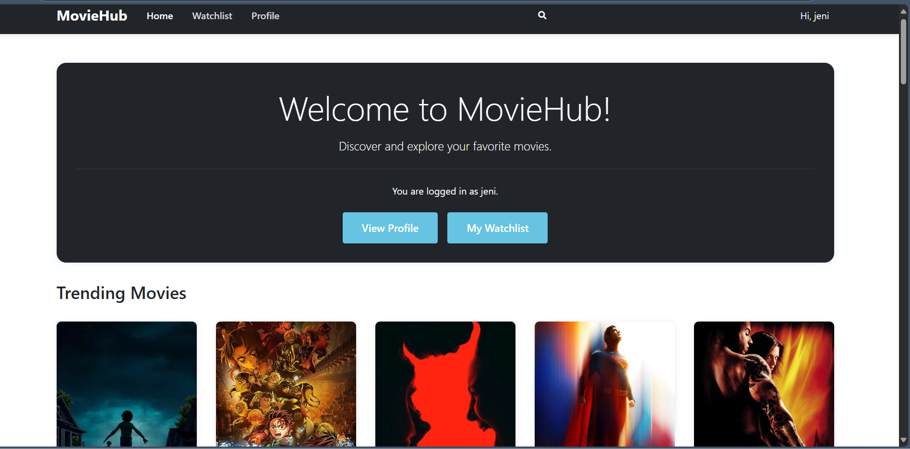
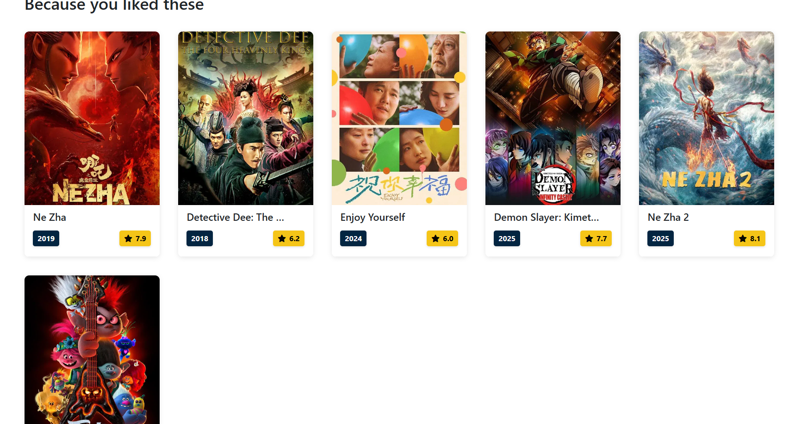
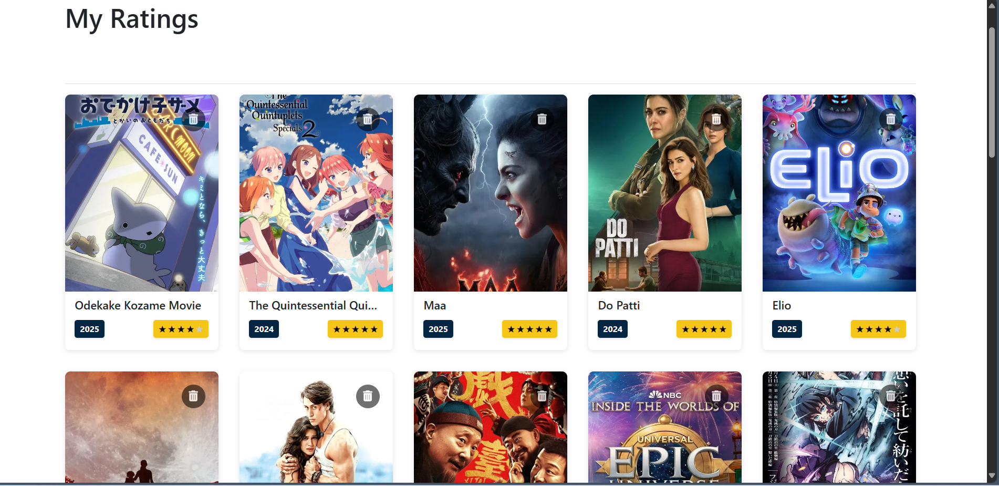
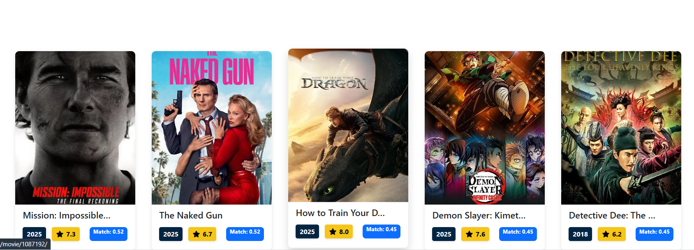
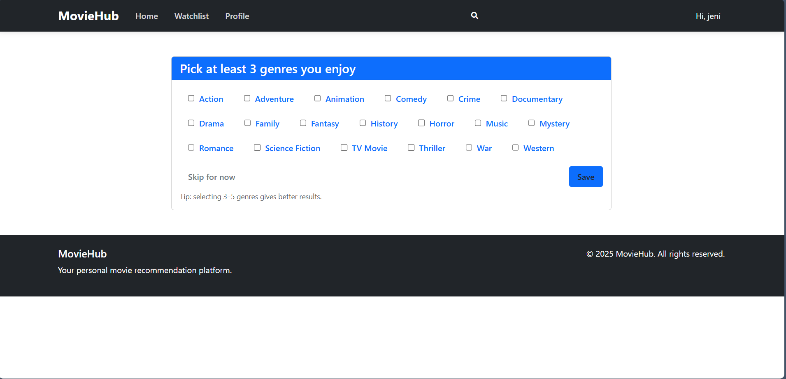

# Movie_Recommendation_System

A web-based movie recommendation system designed to help users discover movies and shows that match their individual preferences. The system implements Collaborative Filtering (User-Based & Item-Based) and Content-Based Filtering (Genre + Cosine Similarity), making recommendations more personalized and relevant.

🚀 Features

🔑 TMDB API Integration – fetches real-time movie details and posters.

🤝 Collaborative Filtering

User-Based CF: Recommends movies based on users with similar tastes.

Item-Based CF: Recommends movies similar to what the user has already liked/rated.

🎭 Content-Based Filtering – recommends movies based on genre similarity using cosine similarity.

📊 Hybrid Approach – combines multiple recommendation techniques.

🌐 Web-Based UI – user-friendly interface for searching, rating, and exploring movies.

🛠️ Tech Stack

Frontend: HTML, CSS, JavaScript, BootStrap

Backend: Python (Django)

Libraries: Pandas, NumPy, Scikit-learn

Database: SQLite / MongoDB

API: TMDB API

Installation & Setup

Clone the repository:
git clone https://github.com/your-username/movie-recommendation-system.git
cd movie-recommendation-system

Install dependencies:
pip install -r requirements.txt

Add your TMDB API key in the config file or .env:
TMDB_API_KEY=your_api_key_here

Activate env:
source venv/Scripts/activate

Run the app:
python manage.py runserver 

Open your browser and go to:
http://127.0.0.1:8000/

Recommendation Algorithms

User-Based Collaborative Filtering – finds similar users and suggests movies they liked.

Item-Based Collaborative Filtering – recommends movies similar to those the user liked.

Content-Based Filtering – uses cosine similarity on genres/features to find related movies.

## 📸 Screenshots  

| Homepage | Item-Based CF | Rating |
|----------|---------------|--------|
|  |  |  |

| Genre Recommend | Genre Select |
|-----------------|--------------|
|  |  |
 

Future Improvements:

Implement hybrid recommendation (weighted CF + content-based).

Deploy the system on Heroku / AWS / Render.
